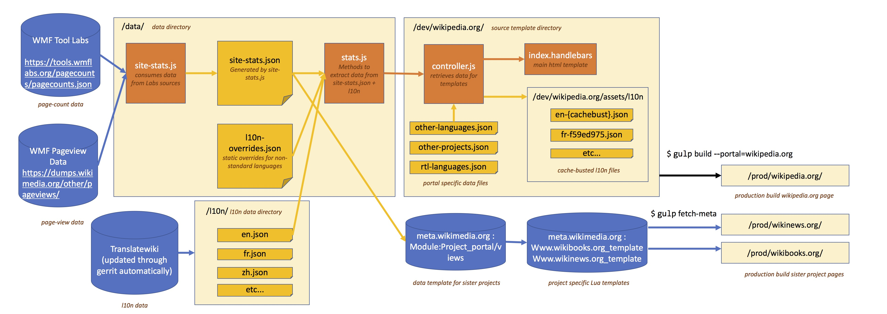

# Wikipedia.org technical Documentation

**TOC**

- **Overview**
- Architecture of portals
	- [Data sources](architecture/data.md)
	- [l10n](architecture/l10n.md)
	- [HTML](architecture/html.md)
	- [CSS](architecture/css.md)
	- [Images](architecture/images.md)
	- [JS](architecture/javascript.md)
- Development Process
	- [Getting Started](development/getting_started.md)
	- [Gulp Tasks](development/gulp.md)
	- [Production Builds](development/prod.md)
	- [Deployment](development/deploy.md)
	- [Sister Project Portals](development/sister_portals.md)

---
## Overview

> NOTE: This documentation is best read online through the repository clone on [diffusion](https://phabricator.wikimedia.org/diffusion/WPOR/browse/master/docs) or [github](https://github.com/wikimedia/portals/tree/master/docs)

The portals are static HTML/CSS/JS pages. However, they use a front-end development stack that includes templates, preprocessors and build-tools to achieve an optimized and performant output. We use [Handlebars](http://handlebarsjs.com/) for HTML templates,  [PostCSS](http://postcss.org/) as a CSS pre-processor, and [Gulp](http://gulpjs.com/) as build tool to stitch everything together.

Templates and source files are located in the `src` folder. The source files are populated with data from the `data` folder and processed using Gulp. During devlopment, the compiled but un-optimized assets remain in the src folder. During a production build, these assets are optimized and copied to the `prod`  folder.

This diagram represents the flow of data and rough order of operation in the portals repository. The data is collected from multiple sources, processed and passed to the templates for rendering.

[Portals repository dataflow diagram](portals-dataflow.jpg)